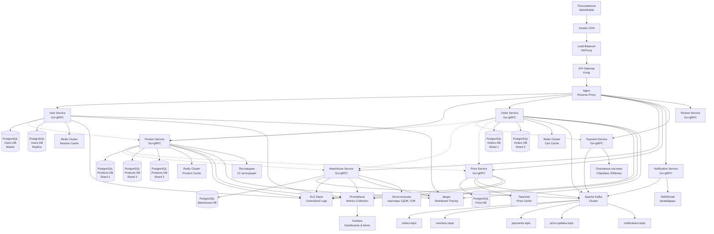

# DNS - Профиль E-commerce компании

## Часть 1: Описание компании и технической инфраструктуры

### 1. Описание компании DNS

**DNS (ДНС)** — крупнейшая российская сеть магазинов цифровой и бытовой техники, один из лидеров российского рынка электронной коммерции.

**Основная деятельность и ассортимент:**
- Цифровая техника (смартфоны, планшеты, ноутбуки, компьютеры)
- Бытовая техника (холодильники, стиральные машины, телевизоры, кондиционеры)
- Аудио и видеотехника (наушники, колонки, проекторы)
- Игровые приставки и аксессуары
- Товары для дома и автомобиля
- Услуги по доставке, установке и сервисному обслуживанию

**Масштаб операций:**
- Работа в России, Казахстане и Беларуси
- Годовой оборот: $4.2 млрд
- 2000+ точек продаж в 1200+ городах
- 47 региональных распределительных центров
- Более 1 млн товарных позиций

**Структура IT-отдела (420 сотрудников):**
- Backend-разработка: 95 разработчиков (Go, Java, Python)
- Frontend-разработка: 55 разработчиков (React, Vue.js, Angular)
- Mobile-разработка: 30 разработчиков (iOS, Android, Flutter)
- DevOps и Infrastructure: 40 инженеров
- Data Engineering и Analytics: 35 специалистов
- QA и Testing: 50 тестировщиков
- Security: 20 специалистов
- Product Management: 30 менеджеров
- Technical Writing: 12 технических писателей
- Architecture и Team Leads: 43 лида и архитектора

### 2. Нагрузка на проект

**Пользовательские метрики:**
- Активные пользователи: 15 миллионов в месяц
- Просмотры страниц: 120 миллионов в день
- Заказы: 850,000 в день (до 1.5 млн в распродажи)
- Пиковая нагрузка: до 12,000 заказов в час

**Технические метрики:**
- Read/Write соотношение: 150:1
- RPS для чтения: 220,000 запросов в секунду
- RPS для записи: 1,800 запросов в секунду
- Объем хранимых данных: 12 ПБ
- Ежедневно генерируемых данных: 950 ГБ

### 3. Технологический стек

**Backend:**
- Golang 1.21+ (основной язык для новых микросервисов)
- Java 17 (legacy системы)
- PostgreSQL 15 (основная БД с шардированием)
- Redis 7.0 (кэширование, сессии, корзины)
- Apache Kafka (асинхронная обработка заказов)
- gRPC (межсервисное взаимодействие)

**Мониторинг и логирование:**
- ELK Stack (Elasticsearch, Logstash, Kibana)
- Prometheus + Grafana (метрики и алерты)
- Jaeger (распределенный трейсинг)
- Sentry (мониторинг ошибок приложений)

**Инфраструктура:**
- Kong API Gateway
- HAProxy Load Balancer
- Nginx (reverse proxy и статика)
- Docker + Kubernetes
- Yandex Cloud (основной провайдер)
- GitLab CI/CD
- HashiCorp Vault (управление секретами)

**Дополнительные технологии:**
- Apache Spark (обработка больших данных)
- ClickHouse (аналитика и отчетность)
- RabbitMQ (уведомления и email очереди)
- MinIO (объектное хранилище для изображений)
- Consul (service discovery)
- Tarantool (высокопроизводительное кэширование)

### 4. Диаграмма архитектуры



### 5. Описание архитектуры системы

**Основные микросервисы на Golang:**

1. **User Service** - управление пользователями, аутентификация, личные кабинеты
2. **Product Service** - каталог товаров, поиск, фильтрация, рекомендательная система
3. **Order Service** - создание заказов, корзина, статусы заказов, история покупок
4. **Warehouse Service** - управление складскими остатками, резервирование, перемещения
5. **Price Service** - управление ценами, скидками, акциями, динамическое ценообразование
6. **Payment Service** - обработка платежей, интеграция с банками и платежными системами
7. **Notification Service** - отправка уведомлений (email, SMS, push, в приложение)
8. **Review Service** - отзывы и рейтинги товаров, модерация контента

**Взаимодействие с базами данных:**
- PostgreSQL кластеры с master-slave репликацией для каждого сервиса
- Горизонтальное шардирование Product Service по category_id (3 шарда)
- Шардирование Order Service по user_id для равномерного распределения нагрузки
- Использование connection pooling (pgxpool) с настройкой под каждый сервис
- Автоматические миграции через golang-migrate с версионированием схем
- Read-запросы направляются на реплики, write-запросы на master

**Использование очередей сообщений:**
- Kafka для критически важных событий с гарантией доставки
- Партиционирование топиков по user_id для обеспечения порядка обработки
- Consumer groups для горизонтального масштабирования обработки
- Dead letter queues для обработки failed messages
- Exactly-once семантика для финансовых операций через идемпотентные ключи

**Интеграция со сторонними сервисами:**
- Платежные системы: Сбербанк Эквайринг, ЮMoney, Тинькофф через Payment Service
- Логистика: СДЭК, ПЭК, Деловые Линии, Почта России через Warehouse Service
- Поставщики: интеграция с 1С для синхронизации товаров и остатков
- SMS/Email: собственная платформа + Twilio для резерва
- Аналитика: интеграция с Яндекс.Метрикой, внутренняя аналитическая платформа

## Часть 2: Рабочие процессы и методологии

### 6. Процесс устройства на работу и онбординга

**Этапы собеседования:**

1. **HR-скрининг (45 минут)**
    - Знакомство с кандидатом и его опытом
    - Обсуждение мотивации и карьерных планов
    - Рассказ о компании, продуктах и команде
    - Предварительная оценка культурного соответствия

2. **Техническое интервью (90 минут)**
    - Живое кодирование на Go (30 минут)
    - Алгоритмические задачи средней сложности (20 минут)
    - Вопросы по Go: goroutines, channels, memory model (25 минут)
    - Базы данных: SQL, индексы, транзакции (15 минут)

3. **Системное интервью (75 минут)**
    - System Design задача на проектирование e-commerce системы (45 минут)
    - Обсуждение архитектурных решений из опыта (20 минут)
    - Вопросы по microservices, distributed systems (10 минут)

4. **Финальное собеседование (60 минут)**
    - Интервью с руководителем команды (30 минут)
    - Soft skills: работа в команде, решение конфликтов (15 минут)
    - Обсуждение условий работы и офера (15 минут)

**Онбординг (3 недели):**

*Неделя 1 - Знакомство и настройка:*
- Оформление документов, получение оборудования (MacBook Pro/ThinkPad)
- Настройка dev окружения: IDE, Git, Docker, kubectl
- Получение доступов к системам: GitLab, Jira, Confluence, Grafana
- Знакомство с командой и структурой компании
- Изучение архитектуры системы и business domain

*Неделя 2 - Погружение в код:*
- Code walkthrough с ментором по основным сервисам
- Изучение coding standards и best practices команды
- Первые задачи: исправление мелких багов, обновление документации
- Участие в daily standups и code review процессе
- Знакомство с мониторингом и debugging инструментами

*Неделя 3 - Самостоятельная работа:*
- Работа над первой feature под наблюдением ментора
- Участие в planning и retrospective встречах
- Знакомство с процессами deployment и rollback
- Получение feedback и планирование дальнейшего развития
- Презентация выполненной работы команде

### 7. Инструменты коммуникации и управления проектами

**Основные инструменты:**
- **Jira** - управление задачами, планирование спринтов, tracking багов
- **Confluence** - документация, архитектурные решения, runbooks, onboarding guides
- **Slack** - повседневная коммуникация, каналы команд, интеграции с системами
- **Google Meet** - видеоконференции, планерки, интервью
- **Miro** - диаграммы, brainstorming сессии, system design

**Ежедневные созвоны (Daily Standup):**
- **Время:** 10:30 каждый рабочий день, 15-20 минут
- **Формат:**
    - Что сделал вчера и какие были блокеры?
    - Что планирую делать сегодня?
    - Нужна ли помощь коллег или есть блокеры?
    - Обсуждение срочных вопросов (deployment, инциденты)
- **Участники:** команда разработки (12 человек), тимлид, иногда PM
- **Инструменты:** Google Meet с shared screen на Jira Sprint Board

**Процесс код-ревью:**

*Участники и роли:*
- Автор кода создает Merge Request в GitLab
- Обязательно минимум 2 апрува: senior разработчик + peer reviewer
- Tech Lead участвует в review архитектурных изменений
- Security review для изменений в authentication/authorization

*Критерии проверки:*
- Соответствие Go coding standards и линтерам (golangci-lint)
- Покрытие unit тестами минимум 85%
- Performance implications и memory leaks
- Security issues: SQL injection, XSS, proper error handling
- API contracts и backward compatibility
- Proper logging и monitoring instrumentation

*Типичная длительность:*
- Мелкие изменения (bug fixes): 2-6 часов
- Средние feature: 1-2 рабочих дня
- Крупные feature или рефакторинг: 2-4 дня
- Архитектурные изменения: до недели

*Детальный процесс:*
1. Создание MR с детальным описанием и ссылками на Jira
2. Автоматические проверки: тесты, линтеры, security scan
3. Code review: статический анализ кода, архитектурный review
4. Автор исправляет замечания и обновляет MR
5. Повторный review и финальный апрув
6. Merge в develop ветку после прохождения CI/CD пайплайна

### 8. Методология разработки

**Основной подход:** Scrum с элементами Kanban для поддержки и hotfixes

**Регулярные встречи:**

*Daily Standup (20 минут, ежедневно в 10:30)*
- Синхронизация команды по текущим задачам
- Выявление и решение блокеров
- Координация работы над пересекающимися задачами
- Обсуждение production issues

*Sprint Planning (3 часа, каждые 2 недели)*
- Обсуждение и уточнение требований с PM
- Декомпозиция epic'ов на user stories
- Оценка story points методом Planning Poker
- Commitment на sprint backlog

*Sprint Review (2 часа, каждые 2 недели)*
- Демонстрация готовых feature stakeholders
- Получение feedback от PM и бизнеса
- Анализ sprint metrics: velocity, burndown
- Планирование следующих приоритетов

*Sprint Retrospective (1.5 часа, каждые 2 недели)*
- Анализ процессов и командной работы
- Выявление проблем и их root causes
- Планирование action items для улучшения
- Обсуждение technical debt и code quality

**Специфические практики команды:**
- **Technical Debt Wednesday** - каждую среду 30% времени на технический долг
- **Architecture Review Board** - еженедельный review крупных архитектурных решений
- **Guild Meetings** - ежемесячные встречи Go-разработчиков для knowledge sharing
- **Post-mortem Culture** - обязательный разбор всех production incidents
- **Innovation Time** - 10% времени на исследование новых технологий и POC
- **Code Quality Gates** - автоматические проверки качества кода в CI/CD

### 9. Git Flow в команде

**Основные ветки:**
- `main` - production-ready код, защищенная ветка
- `develop` - интеграционная ветка для разработки
- `feature/*` - ветки для новых фич и улучшений
- `release/*` - ветки для подготовки релизов
- `hotfix/*` - критические исправления в production

**Правила именования:**

*Ветки:*
```
feature/DNS-1234-implement-order-cancellation
bugfix/DNS-5678-fix-price-calculation-rounding
hotfix/DNS-9999-fix-payment-gateway-timeout
release/v3.2.0-order-management
```

*Коммиты (Conventional Commits):*
```
feat(order): add order cancellation functionality
fix(price): resolve rounding issues in bulk calculations  
docs(api): update order service OpenAPI specification
test(payment): add integration tests for gateway timeout
refactor(user): extract common validation logic
perf(search): optimize product search queries
```

**Процесс создания и мерджа Merge Request:**

1. **Создание feature ветки:**
```bash
git checkout develop
git pull origin develop
git checkout -b feature/DNS-1234-implement-order-cancellation
```

2. **Разработка с промежуточными коммитами:**
```bash
git add .
git commit -m "feat(order): add cancellation endpoint structure"
git commit -m "feat(order): implement business logic for cancellation"
git commit -m "test(order): add unit tests for cancellation flow"
git push origin feature/DNS-1234-implement-order-cancellation
```

3. **Создание Merge Request в GitLab:**
- Заголовок: `[DNS-1234] Implement order cancellation functionality`
- Детальное описание с разделами:
    - **What**: что было сделано
    - **Why**: обоснование изменений
    - **How**: как было реализовано
    - **Testing**: как тестировать
- Линки на Jira task и related issues
- Screenshots/GIFs для UI изменений
- Checklist для reviewer

4. **Процесс код-ревью:**
```bash
# Reviewer checkout ветки для локального тестирования
git fetch origin
git checkout feature/DNS-1234-implement-order-cancellation

# Запуск тестов локально
make test
make integration-test

# Проверка performance impact
make benchmark

# Автор адресует feedback
git add .
git commit -m "fix(order): address code review comments"
git push origin feature/DNS-1234-implement-order-cancellation
```

5. **Мердж в develop после апрува:**
```bash
# Автоматический merge через GitLab после CI success
# Squash commits если много мелких коммитов
# Delete source branch после мерджа
```

**Процесс релиза:**
```bash
# Создание release ветки
git checkout develop
git pull origin develop  
git checkout -b release/v3.2.0-order-management

# Подготовка релиза
# Обновление версий, CHANGELOG, документации
git commit -m "chore(release): prepare v3.2.0"
git push origin release/v3.2.0-order-management

# После тестирования - мердж в main и develop
# Создание git tag
git tag -a v3.2.0 -m "Release v3.2.0: Order Management Features"
git push origin v3.2.0
```

**Hotfix процесс:**
```bash
# Критическое исправление из main
git checkout main
git pull origin main
git checkout -b hotfix/DNS-9999-fix-payment-timeout

# Исправление и тестирование
git commit -m "fix(payment): increase gateway timeout to 30s"
git push origin hotfix/DNS-9999-fix-payment-timeout

# MR в main, потом cherry-pick в develop
git checkout develop
git cherry-pick <hotfix-commit-hash>
```

## Часть 3: Проекты и достижения

### 10. Типичные ежедневные задачи Golang разработчика

**1. Разработка новых API эндпоинтов для мобильного приложения**
- *Описание:* Создание REST API для новых фич мобильного приложения DNS (например, push-уведомления о статусе заказа)
- *Время выполнения:* 3-5 часов
- *Сложности и решения:*
    - Проблема: Различные форматы данных для iOS и Android приводили к дублированию логики
    - Решение: Создал единый API с version negotiation через заголовки, использовал adapter pattern для трансформации ответов
    - Проблема: Rate limiting для предотвращения злоупотребления API
    - Решение: Реализовал middleware с Redis-based sliding window rate limiter, настройки через конфигурацию

**2. Оптимизация производительности поиска товаров**
- *Описание:* Улучшение скорости поиска в каталоге из 1M+ товаров с фильтрацией и сортировкой
- *Время выполнения:* 6-8 часов
- *Сложности и решения:*
    - Проблема: Полнотекстовый поиск в PostgreSQL был медленным на больших объемах
    - Решение: Внедрил Elasticsearch для поиска, PostgreSQL оставил для transactional данных, синхронизация через Kafka
    - Проблема: Faceted search с множественными фильтрами создавал сложные запросы
    - Решение: Денормализовал данные в search index, использовал aggregations Elasticsearch

**3. Исправление критических багов в production**
- *Описание:* Диагностика и устранение ошибок в продакшене, влияющих на пользовательский опыт
- *Время выполнения:* 2-8 часов в зависимости от сложности
- *Сложности и решения:*
    - Проблема: Memory leak в goroutine pool приводил к OOM в Order Service
    - Решение: Использовал pprof для heap analysis, нашел goroutines без proper cancellation context, добавил graceful shutdown
    - Проблема: Deadlock в concurrent обновлении inventory при высокой нагрузке
    - Решение: Переписал на lock-free алгоритм с atomic operations, добавил circuit breaker pattern

**4. Интеграция с внешними API поставщиков**
- *Описание:* Подключение новых поставщиков товаров через их API для автоматической синхронизации каталога и остатков
- *Время выполнения:* 4-6 часов
- *Сложности и решения:*
    - Проблема: Нестабильные API поставщиков с частыми timeout'ами и разными форматами ошибок
    - Решение: Реализовал retry mechanism с exponential backoff, adapter pattern для унификации ошибок, circuit breaker для защиты
    - Проблема: Различные форматы данных (XML, JSON, CSV) требовали разной обработки
    - Решение: Создал pluggable architecture с interfaces для разных форматов, factory pattern для создания парсеров

**5. Мониторинг и алертинг для микросервисов**
- *Описание:* Настройка метрик, dashboard'ов и алертов для отслеживания здоровья сервисов
- *Время выполнения:* 2-4 часа
- *Сложности и решения:*
    - Проблема: Большое количество false positive алертов создавало alert fatigue
    - Решение: Настроил smart alerting с учетом business hours, добавил alert aggregation и correlation
    - Проблема: Сложность корреляции метрик между разными сервисами при debugging
    - Решение: Внедрил distributed tracing с Jaeger, correlation IDs для связывания logs across services

### 11. Ключевые проекты и достижения

**Проект 1: Микросервисная архитектура для управления заказами**

*Описание и цели:*
Переписывание монолитной системы обработки заказов на микросервисную архитектуру для обеспечения масштабируемости во время пиковых нагрузок (Black Friday, распродажи).

*Роль и конкретный вклад:*
- Lead разработчик проекта, координация работы 6 разработчиков
- Проектирование архитектуры Order, Payment, Inventory сервисов
- Реализация event-driven communication через Kafka
- Настройка monitoring и observability для новых сервисов

*Технологии:*
Go 1.20, Kafka, PostgreSQL, Redis, gRPC, Kubernetes, Prometheus, Grafana

*Влияние на проект:*
- **Производительность:** Время обработки заказа сократилось с 2.5 секунд до 800ms (68% улучшение)
- **Ресурсы:** Горизонтальное масштабирование позволило снизить CPU utilization на 45% в нормальных условиях
- **Бизнес:** Обработка 12k заказов/час без degradation (было 4k/hour), предотвращена потеря $5M в Black Friday
- **UX:** 99.9% uptime заказной системы, снижение cart abandonment rate на 23%

**Проект 2: Система динамического ценообразования**

*Описание и цели:*
Разработка сервиса для автоматического управления ценами на основе конкурентного анализа, остатков на складе и спроса.

*Роль и конкретный вклад:*
- Полная архитектура и разработка Price Service с нуля
- Интеграция с внешними API для мониторинга цен конкурентов
- Реализация ML pipeline для price prediction
- Создание admin panel для контроля ценовых стратегий

*Технологии:*
Go, Python (ML models), ClickHouse, Kafka, Redis, Kubernetes, Airflow

*Влияние на проект:*
- **Производительность:** Обновление цен в real-time (было 2 раза в день)
- **Ресурсы:** Автоматизация снизила manual effort на 80%, FTE savings = 3 человека
- **Бизнес:** Увеличение маржинальности на 12%, рост revenue на $50M annually
- **UX:** Конкурентные цены привели к росту customer satisfaction на 18%

**Проект 3: Высокопроизводительная система поиска товаров**

*Описание и цели:*
Модернизация системы поиска для обработки 220k RPS с персонализацией результатов и AI-powered рекомендациями.

*Роль и конкретный вклад:*
- Архитектурный дизайн hybrid search (Elasticsearch + PostgreSQL)
- Реализация caching layer с multi-level cache hierarchy
- Интеграция с ML models для персонализации
- Performance optimization и load testing

*Технологии:*
Go, Elasticsearch, Redis, Tarantool, Kafka,